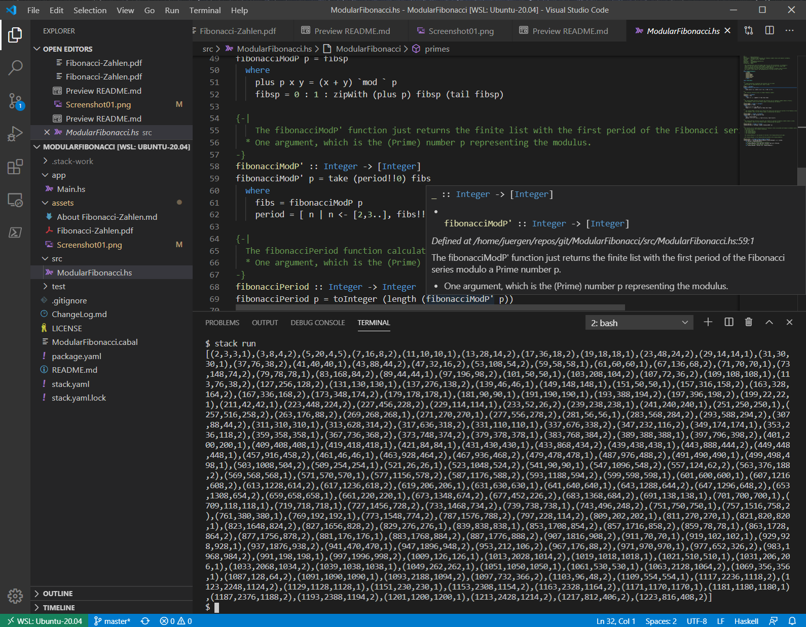

# Fun with Haskell and Fibonacci Numbers

## The Challenge

A while ago I was experimenting with Haskell, and one of my experiments was the Haskell program that forms this project. Actually I posted it first [here](https://juergenpf.wordpress.com/2019/06/15/fun-with-haskell-and-fibonacci-numbers/) on my Wordpress Blog as a single Haskell file, while this is now a bit more modular to reflect a typical - yet simple - structure of a Haskell project with Visual Studio Code.

The first thing you notice when you calculate the Fibonacci series in modulo arithmetic (with a prime modulus) is, that the generated series is periodic. For example, 

> __the Fibonacci series modulo 3 is [0,1,1,2,0,2,2,1,0,1,1,2,0,2,2,1,0,1,..]__,  

which means it is a repetition of the finite list __[0,1,1,2,0,2,2,1]__.  

I define the __FibonacciPeriod__ of a prime p as the length of this finite list generating the Fibonacci series modulo p. So for p=3 we have

> __FibonacciPeriod 3 = 8__

What you also can see in the experiment is, that the FibonacciPeriod of p has usually a large GCD with one of p-1 or p+1. I call this GCD the __FibonacciModulus__ of a prime p. For example, we have

> __FibonacciModulus 3 = 4__

Apparently, the FibonacciModulus being a divisor of the FibonacciPeriod, we can define for a prime p 

> __FibonacciWeight__ p = FibonacciPeriod(p) / FibonacciModulus(p).

Which for example gives

> __FibonacciWeight 3 = 2__

A surprising role in the experiments takes the prime 5. For 5 you get an unusual long period of Fibonacci numbers, actually all other primes in the experiment have periods smaller than the prime, or approx. the size of the prime or twice the size of the prime, which results in all primes except 5 have a FibonacciWeight of 1 or 2, only 5 has the FibonacciWeight 5. 

This gives motivation to these conjectures:

1. __The Fibonacci series modulo a prime is a periodic series__
1. __The FibonacciWeight of a prime is always 1 or 2, except for p=5 where it is 5__

This makes __5__ looking even more magic when it comes to Fibonacci numbers, because for the classical Fibonacci series the ratio f(n+1)/f(n) converges to (1+sqrt(5))/2, a well know and simple to proof fact, where the 5 also comes in magically.
 
Actually, there is mathimatical proof for these conjectures.
See:  [Fibonacci-Zahlen, © Michael Becker](assets/Fibonacci-Zahlen.pdf) (in German. This is a paper that was on the web for quite a while, but the author has cleaned up his [Homepage](http://www.ijon.de/), so I'm hosting a copy here).

## The Haskell environment I use

As good as Haskell as a language is, as immature is its community and the support for easy to use free development environments. The situation is Ok, if you're a command line guy. But very often, casual users or beginners want to have more guidance by a good (visual) tooling.

It looks like some Haskell professionals took the challenge and are working to improve the situation. In recent years we saw the rise of very generic graphical editor environments like Visual Studio Code, Atom, Sublime etc - and there are tons of extensions for various of the most popular and even rare languages. This makes them an interesting target to build some Haskell tooling.

### The Operating System

I'm as much a Linux as a Windows guy, so no religious dispute here. They both have their merits and both are excellent Operating Systems. But when it comes to Haskell, you're much better off by using Linux as your environment. Yes, Haskell is available on Windows, but if you try to build complex packages you ofteh run into challenges that require manual tweaks, as the primary environment of the authors was most certainly Linux.
So I decided to make use of the best of both worlds, which means

1. Windows 10 Pro with [WSL2](https://docs.microsoft.com/en-us/windows/wsl/wsl2-index). The __W__indows __S__ubsystem for __L__inux Version 2 relies on the 2004 Update of Windows 10, providing a Linux Kernel in addition to the Windows Kernel. This allows to run Linux distributions on a Windows system without a need to setup virtual machines. As long as the 2004 Update is not released, one has to use the Windows 10 Insider Build (Slow Ring) to get that functionality.
1. [Ubuntu-20.04 LTS for WSL](https://www.microsoft.com/en-us/p/ubuntu-2004-lts/9n6svws3rx71?activetab=pivot:overviewtab). This is a user space Ubuntu-20.04 distribution that runs with the Linux Kernel provided by Windows 10 Update 2004. In this distribution I then install the regular Haskell tooling provided by the distribution.

### The Editor

I decided to go with [Visual Studio Code](https://code.visualstudio.com/) (no surprise as I'm a retired Microsoftie:-)). Please note, that you should not install this editor in the WSL Linux you use, but on the Windows host. The reason is, that for WSL the ditor provides a special remote extension, that allows to run the editor as Windows app but doing the build in the WSL subsystem (see [here](https://code.visualstudio.com/docs/remote/wsl))

### The Haskell Tooling

1. I'm using the [Haskell Language Server]( https://github.com/haskell/haskell-language-server). I did build that on a linux machine following the build instructions and copied the produced binaries into the /usr/bin directory of my WSL instance.
2. In Visual Studio Code I use the [Haskell Language Server](https://marketplace.visualstudio.com/items?itemName=alanz.vscode-hie-server) extension

The Haskell Language Server is a merger of the previos separate projects [Haskell IDE Engine](https://github.com/haskell/haskell-ide-engine) and [ghcide](https://github.com/digital-asset/ghcide). The server provides all the binaries required by the Visual Studio Code extension.

The result is a basic tooling that allows very nice syntax highlighting, code completion, code navigation, support for displaying Documentation annotations etc.

It's worth mentioning that [Haskell Language Server](https://marketplace.visualstudio.com/items?itemName=alanz.vscode-hie-server) is a brilliant starter for the basic code navigation. But I would like to see features from the [Haskelly](https://marketplace.visualstudio.com/items?itemName=UCL.haskelly) extionsion beeing provided too in the future, especially the ones that automatically discover which buttons may be usefull in the current context and displays these buttons in the status bar. This then provides the very basic feeling of a visual development environment: Edit code and the simply click a button to build, test or run!

P.S.: I recently had success to build ghcide and haskell-language-server on Windows 10, so I can use the tooling also in a plain Windows 10 setup without WSL2.
